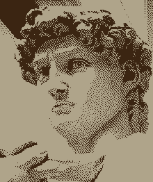
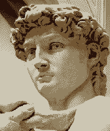

# Libdither

Overview
--------
Libdither is a library for *black-and-white and color image dithering*, written in C (ANSI C99 standard).
Libdither has no external dependencies and should compile easily on most current systems (e.g. Windows, Linux, MacOS).
All you need is a C compiler.

<b>This version of libdither is a *Release Candidate*</b>: it has been tested and is working, but minor code cleanup is still required.

The black-and-white only libdither version can now be found in the [libdither_mono branch](https://github.com/robertkist/libdither/tree/libdither_mono). 

Features
--------

* Color ditherers: error diffusion, ordered dithering
* Mono ditherers: grid dithering, ordered dithering, error diffusion, variable error diffusion (Ostromoukhov, Zhou Fang),
  pattern dithering, Direct Binary Search (DBS), dot diffusion, Kacker and Allebach dithering, Riemersma dithering, thresholding
* Support for color comparison modes: LAB76, LAB94, LAB2000, sRGB, linear, HSV, luminance, Tetrapal
* Support for color reduction: Median-Cut, Wu, KD-Tree
* Support for images with transparent background
* Libdither works in linear color space
* Dither matrices and inputs can be easily extended without having to change the dither code itself
* no external dependencies on other libraries
* works with C and C++ projects
* supports Windows, Linux, MacOS (universal binary support Intel / Apple silicon), and possible others

License Changes and 3rd-Party Code
----------------------------------

Libdither MIT licensed, but the following code parts have their own permissive license:

- [kdtree](https://github.com/jtsiomb/kdtree) license: requires inclusion of license terms in source and binary distributions ([more](https://github.com/jtsiomb/kdtree?tab=License-1-ov-file))
- [uthash](https://github.com/troydhanson/uthash) license: requires inclusion of license terms in source distributions ([more](https://github.com/troydhanson/uthash/blob/master/LICENSE))

Examples Color
--------------

### Palettes:

<table>
<tr>
    <td><b>Original</b></td>
    <td><b>EGA palette (16 colors)<br>error diffusion</b></td>
    <td><b>C64 palette (16 colors)<br>error diffusion</b></td>
</tr><tr>
    <td></td>
    <td></td>
    <td></td>
</tr><tr>
    <td><b>Pico8 palette (16 colors)<br>error diffusion</b></td>
    <td><b>EGA palette (16 colors)<br>void dispersed dots</b></td>
    <td><b>C64 palette (16 colors)<br>void dispersed dots</b></td>
</tr><tr>
    <td></td>
    <td></td>
    <td></td>
</tr>
</table>

Note: Palettes with a good range of hues and brightness, which matches the source
image work best. If the overall palette is too dark, or too bright, the image, too,
will be darker or brighte.

### Color Quantization:

<table>
<tr>
    <td><b>Median-Cut: 16 colors<br>error diffusion</b></td>
    <td><b>Wu: 16 colors<br>error diffusion</b></td>
    <td><b>KD-Tree: 16 colors<br>error diffusion</b></td>
</tr><tr>
    <td></td>
    <td></td>
    <td></td>
</tr>
</table>

Note: Median-Cut and Wu are fairly fast, compared to KD-Tree. However, KD-Tree often gives
the best results.

### Color Reduction:

<table>
<tr>
    <td><b>Original</b></td>
    <td><b>Median-Cut: 2 colors<br>error diffusion</b></td>
    <td><b>Median-Cut: 4 colors<br>error diffusion</b></td>
</tr><tr>
    <td></td>
    <td></td>
    <td></td>
</tr><tr>
    <td><b>Median-Cut: 8 colors<br>error diffusion</b></td>
    <td><b>Median-Cut: 16 colors<br>error diffusion</b></td>
    <td><b>Median-Cut: 32 colors<br>error diffusion</b></td>
</tr><tr>
    <td></td>
    <td></td>
    <td></td>
</tr>
</table>

Note: With a palette that matches the original palette well, 32 colors are often sufficient.

### Color Matching / Color Distance function:

<table>
<tr>
    <td><b>LAB '76: 16 colors<br>error diffusion</b></td>
    <td><b>LAB '04: 16 colors<br>error diffusion</b></td>
    <td><b>LAB 2000: 16 colors<br>error diffusion</b></td>
</tr><tr>
    <td></td>
    <td></td>
    <td></td>
</tr><tr>
    <td><b>sRGB: 16 colors<br>error diffusion</b></td>
    <td><b>sRGB CCIR: 16 colors<br>error diffusion</b></td>
    <td><b>linear: 16 colors<br>error diffusion</b></td>
</tr><tr>
    <td></td>
    <td></td>
    <td></td>
</tr><tr>
    <td><b>linear: 16 colors<br>error diffusion</b></td>
    <td><b>linear CCIR: 16 colors<br>error diffusion</b></td>
    <td><b>HSV: 16 colors<br>error diffusion</b></td>
</tr><tr>
    <td></td>
    <td></td>
    <td></td>
</tr><tr>
    <td><b>luminance: 4 colors<br>error diffusion</b></td>
    <td><b>LAB 2000: 4 colors<br>error diffusion</b></td>
    <td><b>HSV: 4 colors<br>error diffusion</b></td>
</tr><tr>
    <td></td>
    <td></td>
    <td></td>
</tr>
</table>

Notes:

- Different color distance measuring methods are supported for finding the closest color in the target palette.
- sRGB distance is a good, universally applicable choice.
- LAB2000 distance is the most accurate method. It works best with well balanced palettes, where it can pick up even subtle nuances, but it is slow.
- Luminance distance works best for gradients.
- CCIR distance methods take human perceptions into account and add a slight saturation boost.
- Other distance methods may work better than others in certain cases - make sure to try them.


Examples Mono
-------------

<table>
<tr>
    <td><b>Original</b></td>
    <td><b>Grid dither</b></td>
    <td><b>Xot error diffusion</b></td>
</tr><tr>
    <td></td>
    <td></td>
    <td></td>
</tr><tr>
    <td><b>Diagonal error diffusion</b></td>
    <td><b>Floyd Steinberg error diffusion</td>
    <td><b>ShiauFan 3 error diffusion</b></td>
</tr><tr>
    <td></td>
    <td></td>
    <td></td>
</tr><tr>
    <td><b>ShiauFan 2 error diffusion</b></td>
    <td><b>ShiauFan 1 error diffusion</b></td>
    <td><b>Stucki error diffusion</td>
</tr><tr>
    <td></td>
    <td></td>
    <td></td>
</tr><tr>
    <td><b>1D error diffusion</b></td>
    <td><b>2D error diffusion</b></td>
    <td><b>Fake Floyd Steinberg error diffusion</b></td>
</tr><tr>
    <td></td>
    <td></td>
    <td></td>
</tr><tr>
    <td><b>Jarvis-Judice-Ninke error diffusion</td>
    <td><b>Atkinson error diffusion</b></td>
    <td><b>Burkes error diffusion</b></td>
</tr><tr>
    <td></td>
    <td></td>
    <td></td>
</tr><tr>
    <td><b>Sierra 3 error diffusion</b></td>
    <td><b>Sierra 2-row error diffusion</td>
    <td><b>Sierra Lite error diffusion</b></td>
</tr><tr>
    <td></td>
    <td></td>
    <td></td>
</tr><tr>
    <td><b>Steve Pigeon error diffusion</b></td>
    <td><b>Robert Kist error diffusion</b></td>
    <td><b>Stevenson Arce error diffusion</td>
</tr><tr>
    <td></td>
    <td></td>
    <td></td>
</tr><tr>
    <td><b>Blue Noise dithering</b></td>
    <td><b>Bayer 2x2 ordered dithering</b></td>
    <td><b>Bayer 3x3 ordered dithering</b></td>
</tr><tr>
    <td></td>
    <td></td>
    <td></td>
</tr><tr>
    <td><b>Bayer 4x4 ordered dithering</td>
    <td><b>Bayer 8x8 ordered dithering</b></td>
    <td><b>Bayer 16x16 ordered dithering</b></td>
</tr><tr>
    <td></td>
    <td></td>
    <td></td>
</tr><tr>
    <td><b>Bayer 32x32 ordered dithering</b></td>
    <td><b>Dispersed Dots v1 ordered dithering</td>
    <td><b>Dispersed Dots v2 ordered dithering</b></td>
</tr><tr>
    <td></td>
    <td></td>
    <td></td>
</tr><tr>
    <td><b>Ulichney Void Dispersed Dots ordered dithering</b></td>
    <td><b>Non-Rectangular v1 ordered dithering</b></td>
    <td><b>Non-Rectangular v2 ordered dithering</b></td>
</tr><tr>
    <td></td>
    <td></td>
    <td></td>
</tr><tr>
    <td><b>Non-Rectangular v3 ordered dithering</b></td>
    <td><b>Non-Rectangular v4 ordered dithering</b></td>
    <td><b>Ulichney Bayer 5x5 ordered dithering</td>
</tr><tr>
    <td></td>
    <td></td>
    <td></td>
</tr><tr>
    <td><b>Ulichney ordered dithering</b></td>
    <td><b>Clustered Dot v1 ordered dithering</b></td>
    <td><b>Clustered Dot v2 ordered dithering</b></td>
</tr><tr>
    <td></td>
    <td></td>
    <td></td>
</tr><tr>
    <td><b>Clustered Dot v3 ordered dithering</b></td>
    <td><b>Clustered Dot v4 ordered dithering</b></td>
    <td><b>Clustered Dot v5 ordered dithering</b></td>
</tr><tr>
    <td></td>
    <td></td>
    <td></td>
</tr><tr>
    <td><b>Clustered Dot v6 ordered dithering</b></td>
    <td><b>Clustered Dot v7 ordered dithering</b></td>
    <td><b>Clustered Dot v8 ordered dithering</b></td>
</tr><tr>
    <td></td>
    <td></td>
    <td></td>
</tr><tr>
    <td><b>Clustered Dot v9 ordered dithering</b></td>
    <td><b>Clustered Dot v10 ordered dithering</b></td>
    <td><b>Clustered Dot v11 ordered dithering</b></td>
</tr><tr>
    <td></td>
    <td></td>
    <td></td>
</tr><tr>
    <td><b>Central White-Point ordered dithering</b></td>
    <td><b>Balanced Central White-Point ordered dithering</b></td>
    <td><b>Diagonal ordered dithering</b></td>
</tr><tr>
    <td></td>
    <td></td>
    <td></td>
</tr><tr>
    <td><b>Ulichney Clustered Dot ordered dithering</b></td>
    <td><b>ImageMagick 5x5 Circle ordered dithering</b></td>
    <td><b>ImageMagick 6x6 Circle ordered dithering</b></td>
</tr><tr>
    <td></td>
    <td></td>
    <td></td>
</tr><tr>
    <td><b>ImageMagick 7x7 Circle ordered dithering</b></td>
    <td><b>ImageMagick 4x4 45-degree ordered dithering</b></td>
    <td><b>ImageMagick 6x6 45-degree ordered dithering</b></td>
</tr><tr>
    <td></td>
    <td></td>
    <td></td>
</tr><tr>
    <td><b>ImageMagick 8x8 45-degree ordered dithering</b></td>
    <td><b>ImageMagick 4x4 ordered dithering</b></td>
    <td><b>ImageMagick 6x6 ordered dithering</b></td>
</tr><tr>
    <td></td>
    <td></td>
    <td></td>
</tr><tr>
    <td><b>ImageMagick 8x8 ordered dithering</b></td>
    <td><b>Variable 2x2 ordered dithering</b></td>
    <td><b>Variable 4x4 ordered dithering</b></td>
</tr><tr>
    <td></td>
    <td></td>
    <td></td>
</tr><tr>
    <td><b>Interleaved Gradient ordered dithering</b></td>
    <td><b>Ostromoukhov variable error diffusion</b></td>
    <td><b>Zhou Fang variable error diffusion</b></td>
</tr><tr>
    <td></td>
    <td></td>
    <td></td>
</tr><tr>
    <td><b>Thresholding</b></td>
    <td><b>DBS v1 dithering</b></td>
    <td><b>DBS v2 dithering</b></td>
</tr><tr>
    <td></td>
    <td></td>
    <td></td>
</tr><tr>
    <td><b>DBS v3 dithering</b></td>
    <td><b>DBS v4 dithering</b></td>
    <td><b>DBS v5 dithering</b></td>
</tr><tr>
    <td></td>
    <td></td>
    <td></td>
</tr><tr>
    <td><b>DBS v6 dithering</b></td>
    <td><b>DBS v7 dithering</b></td>
    <td><b>Kacker and Allebach dithering</b></td>
</tr><tr>
    <td></td>
    <td></td>
    <td></td>
</tr><tr>
    <td><b>Modified Riemersma (Hilbert Curve 1) dithering</b></td>
    <td><b>Modified Riemersma (Hilbert Curve 2) dithering</b></td>
    <td><b>Modified Riemersma (Peano Curve) dithering</b></td>
</tr><tr>
    <td></td>
    <td></td>
    <td></td>
</tr><tr>
    <td><b>Modified Riemersma (Fass0 Curve) dithering</b></td>
    <td><b>Modified Riemersma (Fass1 Curve) dithering</b></td>
    <td><b>Modified Riemersma (Fass2 Curve) dithering</b></td>
</tr><tr>
    <td></td>
    <td></td>
    <td></td>
</tr><tr>
    <td><b>Modified Riemersma (Gosper Curve) dithering</b></td>
    <td><b>Modified Riemersma (Fass Spiral) dithering</b></td>
    <td><b>Riemersma (Hilbert Curve 1) dithering</b></td>
</tr><tr>
    <td></td>
    <td></td>
    <td></td>
</tr><tr>
    <td><b>Riemersma (Hilbert Curve 2) dithering</b></td>
    <td><b>Riemersma (Peano Curve) dithering</b></td>
    <td><b>Riemersma (Fass0 Curve) dithering</b></td>
</tr><tr>
    <td></td>
    <td></td>
    <td></td>
</tr><tr>
    <td><b>Riemersma (Fass1 Curve) dithering</b></td>
    <td><b>Riemersma (Fass2 Curve) dithering</b></td>
    <td><b>Riemersma (Gosper Curve) dithering</b></td>
</tr><tr>
    <td></td>
    <td></td>
    <td></td>
</tr><tr>
    <td><b>Riemersma (Fass Spiral) dithering</b></td>
    <td><b>Pattern (2x2) dithering</b></td>
    <td><b>Pattern (3x3 v1) dithering</b></td>
</tr><tr>
    <td></td>
    <td></td>
    <td></td>
</tr><tr>
    <td><b>Pattern (3x3 v2) dithering</b></td>
    <td><b>Pattern (3x3 v3) dithering</b></td>
    <td><b>Pattern (4x4) dithering</b></td>
</tr><tr>
    <td></td>
    <td></td>
    <td></td>
</tr><tr>
    <td><b>Pattern (5x2) dithering</b></td>
    <td><b>Lippens and Philips v1 dot dithering</b></td>
    <td><b>Lippens and Philips v2 dot dithering</b></td>
</tr><tr>
    <td></td>
    <td></td>
    <td></td>
</tr><tr>
    <td><b>Lippens and Philips v3 dot dithering</b></td>
    <td><b>Lippens and Philips (Guo Liu 16x16) dot dithering</b></td>
    <td><b>Lippens and Philips (Mese and Vaidyanathan 16x16) dot dithering</b></td>
</tr><tr>
    <td></td>
    <td></td>
    <td></td>
</tr><tr>
    <td><b>Lippens and Philips (Knuth) dot dithering</b></td>
    <td><b>Knuth dot diffusion</b></td>
    <td><b>Mini-Knuth dot diffusion</b></td>
</tr><tr>
    <td></td>
    <td></td>
    <td></td>
</tr><tr>
    <td><b>Optimized Knuth dot diffusion</b></td>
    <td><b>Mese and Vaidyanathan 8x8 diffusion</b></td>
    <td><b>Mese and Vaidyanathan 16x16 dot diffusion</b></td>
</tr><tr>
    <td></td>
    <td></td>
    <td></td>
</tr><tr>
    <td><b>Guo Liu 8x8 dot diffusion</b></td>
    <td><b>Guo Liu 16x16 dot diffusion</b></td>
    <td><b>Spiral dot diffusion</b></td>
</tr><tr>
    <td></td>
    <td></td>
    <td></td>
</tr><tr>
    <td><b>Inverted Spiral dot diffusion</b></td>
</tr><tr>
    <td></td>
</tr>
</table>

Building Libdither
------------------
You need an ANSI C compiler and the make utility. Run ```make``` to display all build options.
By default, libdither is built for the current architecture.
Once compiled, you can find the finished library in the ```dist``` directory.

*MacOS notes*:

* Installing the XCode command line tools is all you need for building libdither
* You can choose if you want to build a x64, arm64 or universal library. The demo, however, only builds against the current machine's architecture.

*Linux notes*:

* ```gcc``` and ```make``` is all you need to build libdither. E.g. on Ubuntu you should install build-essential via ```apt``` to get these tools.

*Windows notes*:

* You can build both MingW and MSVC targets from the Makefile (sorry, no .sln)
* For MingW, open the Makefile and ensure the path (on top of the file) points to your MingW installation directory
* Install make via Chocolatey package manager from chocolatey.org (https://chocolatey.org/, https://chocolatey.org/packages/make)

Usage
-----
The ```src/demo``` example shows how to load an image (we use .bmp as it's an easy format to work with),
convert it to linear color space, dither it, and write it back to an output .bmp file. The demo was used
to create all the dithering examples you can see below.

You can also look at ```libdither.h```, which includes commentary on how to use libdither.

In your own code, you only need to ```#include "libdither.h"```, which includes all public functions
and data structures, and link the libdither library, either statically or dynamically.
